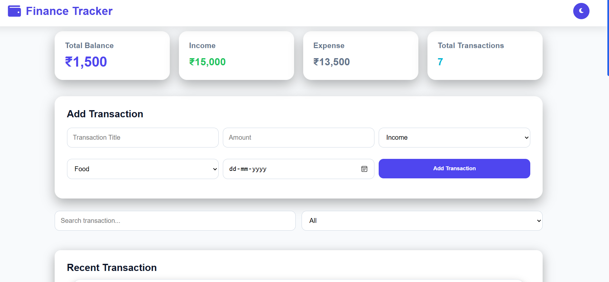
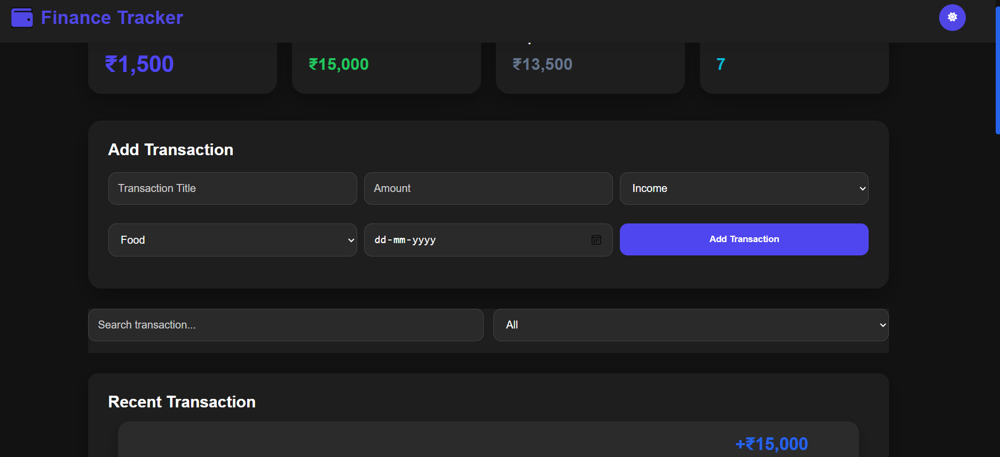
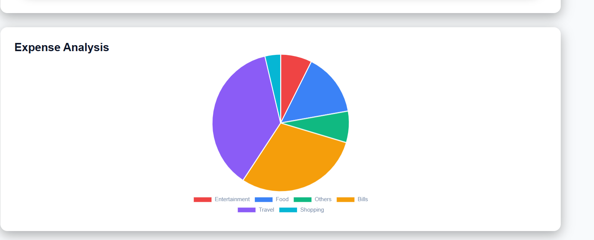
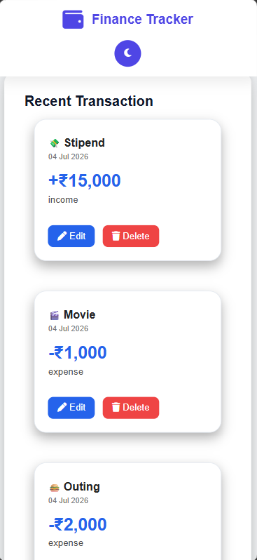

# 💰 Finance Tracker

A modern and responsive Finance Tracker web application built using HTML, CSS, and JavaScript. It helps users manage income and expenses, track their balance, and visualize spending through an interactive chart.

## 🚀 Features

- ➕ Add Transactions
- ✏️ Edit Transactions
- 🗑 Delete Transactions
- 🔍 Search Transactions
- 📂 Filter Income & Expense
- 💾 Local Storage Support
- 📊 Expense Analysis Chart
- 🌙 Dark Mode
- 📱 Responsive Design

## 🛠 Technologies Used

- HTML5
- CSS3
- JavaScript (ES6)
- Chart.js
- Local Storage API

## 📷 Screenshots

### Dashboard (Light Mode)

### Dashboard (Dark Mode)

### Expense Chart

### Mobile View

## 📂 Folder Structure

Finance-Tracker/
│── css/
│── js/
│── index.html
│── README.md

## 🎯 Future Improvements

- Export to PDF
- Monthly Reports
- User Login
- Cloud Database
- Budget Planner

## 👨‍💻 Author

Wasqua Imtiaz
Brainware University
